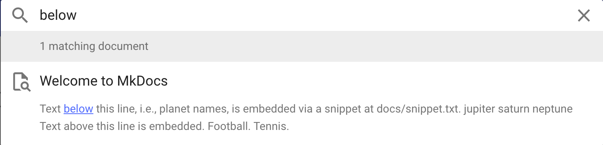
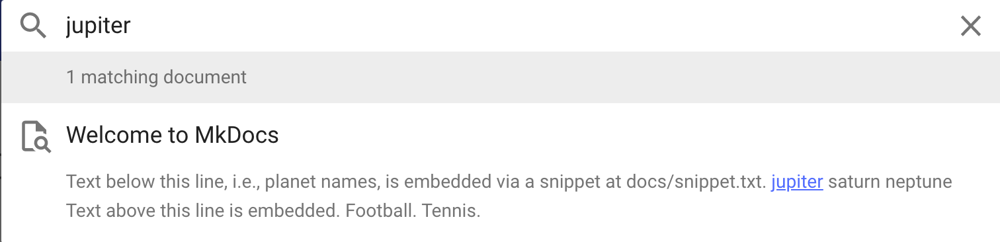
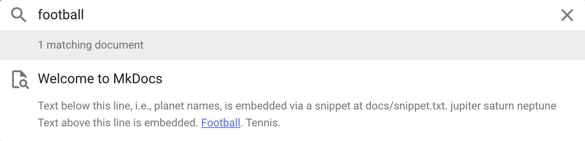

Minimal example to reproduce https://github.com/squidfunk/mkdocs-material/discussions/2313

* [docs/index.md](docs/index.md) - minimal page that embeds [docs/snippet.txt](docs/snippet.txt), with some text before and after the embedded snippet
* [mkdocs.yml](mkdocs.yml) - minimal configuration

## `<hX>` HTML heading tags in the embedded snippet break search result previews

As soon as any `<h[1-6]>` tag is in [docs/snippet.txt](docs/snippet.txt), the search result previews break in the following way:

* None of the text in the snippet is included in the preview.
* None of the text in `docs/index.md` that appears *after* the snippet is included in the preview.

Example screenshots:

## Works fine when no `<hX>` tag is in the embedded snippet

Replacing the `<h3>` tag in [docs/snippet.txt](docs/snippet.txt) with any other HTML tag, like `
`, `<code>`, or even `<head>`,
fixes the broken search result previews.

*Environment*

* mkdocs v1.1.2
* mkdocs-material v6.2.8
* mkdocs-material-extensions v1.0.1

