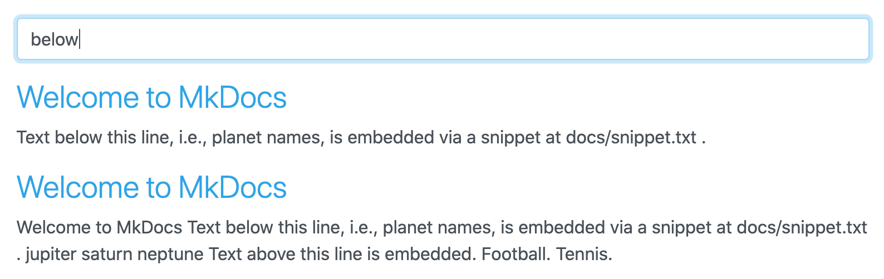
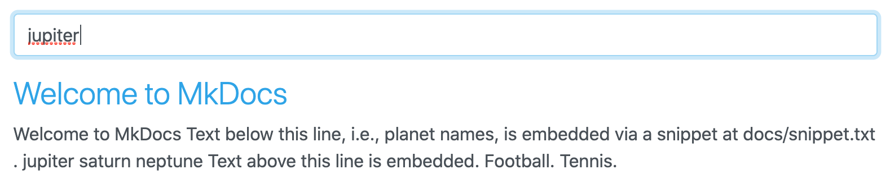
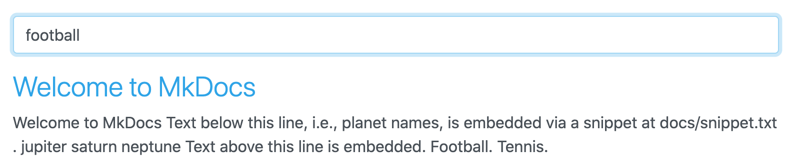

MkDocs only (no Material theme) example to reproduce https://github.com/squidfunk/mkdocs-material/discussions/2313

* [docs/index.md](docs/index.md) - minimal page that embeds [docs/snippet.txt](docs/snippet.txt), with some text before and after the embedded snippet
* [mkdocs.yml](mkdocs.yml) - minimal configuration (vanilla MkDocs, plus `pymdownx.snippets` extension

## Result: everything works as expected

*Environment*

* mkdocs v1.1.2
* pymdown-extensions v8.1.1
